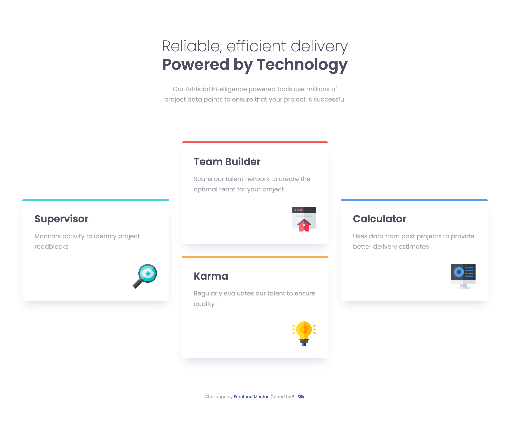

# Frontend Mentor - Four card feature section solution

This is a solution to the [Four card feature section challenge on Frontend Mentor](https://www.frontendmentor.io/challenges/four-card-feature-section-weK1eFYK). Frontend Mentor challenges help you improve your coding skills by building realistic projects.

## Table of contents

- [Overview](#overview)
  - [The challenge](#the-challenge)
  - [Screenshot](#screenshot)
  - [Links](#links)
- [My process](#my-process)
  - [Built with](#built-with)
  - [What I learned](#what-i-learned)
  - [Continued development](#continued-development)
  - [Useful resources](#useful-resources)
- [Author](#author)
- [Acknowledgments](#acknowledgments)

## Overview

### The challenge

Users should be able to:

- View the optimal layout for the site depending on their device's screen size

### Screenshot



### Links

- Solution URL: [https://github.com/elisilk/four-card-feature-section](https://github.com/elisilk/four-card-feature-section)
- Live Site URL: [https://elisilk.github.io/four-card-feature-section/](https://elisilk.github.io/four-card-feature-section/)

## My process

### Built with

- Semantic HTML5 markup
- CSS custom properties
- Flexbox
- CSS Grid
- Mobile-first workflow

### What I learned

I can't take credit for this solution, as I just followed along with Kevin Powell's [YouTube video](https://youtu.be/JFbxl_VmIx0?si=xBqWtxCKLFNJ768b) that talked aloud as he developed his solution to the challenge. But even though it was his solution, th overall thinking and organization were definitely things I learned.

I loved the way Kevin set up his CSS custom variables, primarily in the _root_ but also some within some specific selectors. Here is the _root_ setup:

```css
:root {
  --ff-sans: "Poppins", sans-serif;

  --fw-light: 200;
  --fw-normal: 400;
  --fw-bold: 600;

  --fs-400: 0.9375rem;
  --fs-500: 1.25rem;
  --fs-600: 1.625rem;
  --fs-900: 2.5rem;

  --clr-neutral-100: hsl(0, 0%, 98%);
  --clr-neutral-400: hsl(229, 6%, 66%);
  --clr-neutral-900: hsl(234, 12%, 34%);

  --clr-teal: hsl(180deg 63% 54%);
  --clr-red: hsl(360deg 79% 62%);
  --clr-blue: hsl(212deg 83% 63%);
  --clr-yellow: hsl(33deg 96% 64%);
}
```

I also learned about organizing a basic HTML component, like a [card](https://developer.mozilla.org/en-US/docs/Web/CSS/Layout_cookbook/Card):

```html
<div class="card border-teal">
  <h2 class="card__title">Supervisor</h2>
  <p>Monitors activity to identify project roadblocks</p>
  
</div>
```

And how to use _divs_ effectively for a single purpose, such as wrapper, layout, and column.

```html
<div class="wrapper">
  <div class="layout-grid">
    <div class="col">
      <div class="card border-teal">
        <h2 class="card__title">Supervisor</h2>
        <p>Monitors activity to identify project roadblocks</p>
        
      </div>
    </div>
  </div>
</div>
```

### Continued development

There is definitely much to learn. For the interesting layout of the cards in the desktop view, Kevin implemented both a flex and grid solution. It was nice to see both solutions. Although the grid solution uses less markup, the flex solution feels a little more straightforward in terms of how the design was intended to be laid out. But not sure. Need to consider this more and understand how to use both flex and grid, and under what conditions each are more appropriate.

### Useful resources

- [Responsive layout practice for beginners](https://youtu.be/JFbxl_VmIx0?si=xBqWtxCKLFNJ768b) - This YouTube video by Kevin Powell, in which he talks aloud while solving this particular Frontend Mentor challenge. Clearly, this one was a big help.
- [MDN Web Docs for CSS](https://developer.mozilla.org/en-US/docs/Web/CSS) - Went here a lot to reference the different CSS properties and the shorthands, and all the great explanations about best practices.

## Author

- Website - [Eli Silk](https://github.com/elisilk)
- Frontend Mentor - [@elisilk](https://www.frontendmentor.io/profile/elisilk)

## Acknowledgments

I definitely want to acknowledge [Kevin Powell](https://www.kevinpowell.co/). Kevin's email newsletter inspired me to give Frontend Mentor a try, and his YouTube video walking through this solution was the hand holding I needed to get started.
